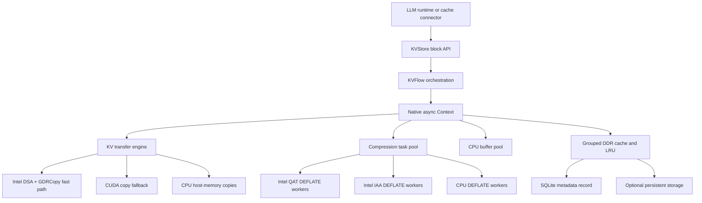
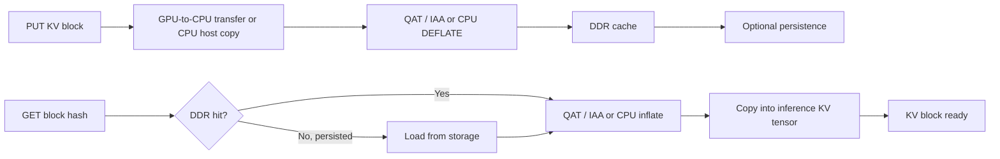

# IAXL Design

## Purpose

IAXL is an Intel reference solution that demonstrates how Intel data-movement and compression accelerators improve LLM inference infrastructure. It provides a block-oriented data path for copying KV cache blocks from inference tensors, compressing them, and retaining them in host memory or persistent storage. Inference tensors can reside on CPU, CUDA, or XPU devices.

The design keeps model kernels unchanged. Integrations use the Python `KVStore` API, while IAXL selects native transfer and compression backends underneath it.

## Responsibilities

- Store and retrieve KV blocks by stable hashes.
- Move fragmented KV blocks between GPU and CPU memory, or codec them in place for CPU inference.
- Compress cached data with Intel QuickAssist Technology (QAT) or Intel In-Memory Analytics Accelerator (IAA), with a compatible CPU DEFLATE backend.
- Keep hot data in a capacity-bounded DDR cache and optionally persist groups to local storage.
- Execute transfer, compression, and storage work asynchronously and expose completion through task handles.

## Architecture

`KVStore` owns model- and rank-local cache state. `KVFlow` converts tensor layers and block indices into asynchronous native tasks. The native `Context` coordinates transfer completion, compression, cache insertion, lookup, decompression, and buffer lifetime.

## KV Block Flow

On `PUT`, IAXL copies selected chunks from inference tensors into reusable CPU buffers. Compression starts only after the transfer is complete, then the encoded payload is inserted into the grouped cache. On `GET`, IAXL resolves the hash, reloads persisted data on a DDR miss when available, decompresses into CPU buffers, and copies the requested chunks back to the selected inference tensor positions.

### CPU Inference

`DEVICE=cpu` keeps the same `Context`/`KVStore` API but changes the data path, because
on CPU every byte the cache path moves is DRAM bandwidth and a core taken from the
model's own GEMMs.

**Direct codec path (no scratch).** Blocks are addressed as `ChunkView`s: strided
slices of the inference tensor (`outer_dims` runs of `inner_size` bytes). On PUT the
codec worker gathers the view straight into the accelerator's own staging buffer
(QAT/IAA DMA buffer or the zlib slot buffer), applies lossy truncation and byte
shuffle there, and submits; the inference tensor is only ever read. On GET the
worker undoes the shuffle inside the codec's output buffer and scatters it straight
into the KV tensor. Compared with the GPU-style staging path this removes the
snapshot copy, the scratch-to-staging copy and the single-threaded transfer-queue
copy — three DRAM passes over the uncompressed block. No `ScratchPool` is created
on CPU. Raw (uncompressed) blocks are a single
gather/scatter between the KV tensor and the cache payload.

**Core partitioning.** `IAXL_CPU_AFFINITY` pins every IAXL native thread (the
`H2D`/`D2H`/`OMP-Main` queue workers and each codec OpenMP worker) to a CPU list
disjoint from `VLLM_CPU_OMP_THREADS_BIND`; the connector refuses more than one codec
thread on inference CPUs and warns for one. Without this the codec pollers preempt
inference OpenMP threads and the cost surfaces as libgomp barrier spin, not as codec
time.

**Consolidated pollers.** `IAXL_QAT_POLL_THREADS` / `IAXL_IAA_POLL_THREADS` size the
codec team independently of the instance count: poller *p* of *P* drives instances
*p, p+P, …* and all their queue slots through a non-blocking `poll` per slot,
completing and refilling whichever slot finished first. A poller that completes
nothing in a full pass spins on `pause` for a bounded count, then `sched_yield`s.
One poller can therefore keep several QAT instances saturated from a single core.
IAA's wait loop uses the same bounded-spin policy as QAT.

**Intel DSA for host copies.** CPU builds compile the host-only `dsa_memcpy`
(no GDRCopy). With `IAXL_DSA_MEMCPY_ENABLE=1`, raw blocks in both directions are
issued as a DSA batch through the work queues in `IAXL_DSA_WQS` using user virtual
addresses (8-byte aligned segments, batches of at least `IAXL_DSA_MEMCPY_MIN_BYTES`).
QAT/IAA slots additionally run as a stage machine — staging copies, codec, scatter
copies — whose per-block copies (payload into the device input buffer, unshuffled
gather into it, and unshuffled scatter into the KV tensor) are submitted to DSA
asynchronously, so a poller keeps its other slots busy while DSA moves the bytes.
Async copies hold a per-WQ credit because a dedicated WQ drops submissions beyond
its size. On the first failure the process warns once and stays on `memcpy`.
Shuffled blocks are transformed on the CPU in the same pass as the gather/scatter.

The CPU connector derives the block axis from the attention layout (`[2, blocks,
heads, tokens, head_size]` with block dimension 1, or the HND `[blocks, heads,
tokens, 2·head_size]` layout with block dimension 0). CPU persistence has a separate
`cpu` directory under the configured cache root, since GPU cache layouts can differ
despite identical byte sizes. The payload format, layerwise waits, and storage
lifecycle are shared with the GPU path. `IAXL_USE_SYSTEM_QAT=ON` optionally links
installed QATlib/USDM for VFIO deployments without changing the CPA implementation.

## Intel Accelerator Optimizations

### Intel DSA

On supported CUDA systems, IAXL uses GDRCopy to map GPU memory into a CPU-visible BAR address and submits fragmented H2D or D2H regions as an Intel DSA batch. This offloads data movement and avoids issuing many small copy operations through the normal GPU copy path. If DSA is disabled, unavailable, or cannot serve a tensor layout, IAXL falls back to batched CUDA copies.

### Intel QAT and Intel IAA

Intel QAT and Intel IAA perform DEFLATE compression and decompression outside the model compute path. Both keep multiple operations in flight, and optional CPU workers consume the same dynamic task pool. All backends produce compatible streams, so work is balanced by completion rate rather than statically partitioned by block.

Optional byte shuffling improves BF16 compressibility, and independently configured lossy LSB truncation can trade precision for a higher compression ratio. Compressing KV blocks increases effective DDR and storage capacity and reduces persistence traffic. When QAT or IAA is enabled, the expensive DEFLATE work is offloaded to dedicated hardware and queued asynchronously, targeting substantial size reduction with minimal impact on inference performance.

## Design Optimizations

- **Asynchronous pipeline:** native work queues, plus device streams on GPUs, overlap transfer, compression, and inference where dependencies allow.
- **Batch-oriented movement:** block fragments are copied in batches; DSA requires an 8-byte-aligned inner copy width, and unsupported layouts automatically use CUDA copies.
- **Pinned-buffer reuse:** `ScratchPool` avoids allocation and registration on the GPU hot path; CPU inference codecs the KV tensor directly and needs no scratch buffers.
- **Hybrid compression:** QAT and IAA provide the accelerated paths; CPU workers provide additional throughput and a compatible software path.
- **Selective compression:** latency-sensitive leading layers can bypass compression while later layers remain compressed.
- **Capacity management:** grouped entries, LRU tracking, and explicit persist/evict operations bound DDR use without changing block identity.
- **Topology-aware deployment:** each tensor-parallel rank can be bound to nearby CPU cores, QAT or IAA devices, and DSA work queues.

IAXL is intentionally a narrow infrastructure layer: it provides reusable hardware-accelerated KV movement and storage primitives, while serving frameworks retain ownership of scheduling and request semantics.
