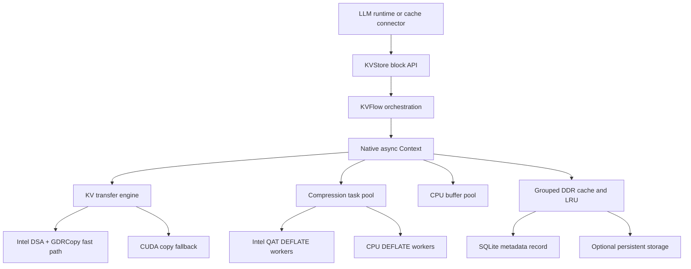
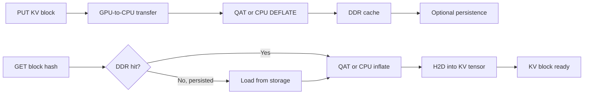

# IAXL Design

## Purpose

IAXL is an Intel reference solution that demonstrates how Intel data-movement and compression accelerators improve LLM inference infrastructure. It provides a block-oriented data path for moving KV cache tensors out of accelerator memory, compressing them, and retaining them in host memory or persistent storage.

The design keeps model kernels unchanged. Integrations use the Python `KVStore` API, while IAXL selects native transfer and compression backends underneath it.

## Responsibilities

- Store and retrieve KV blocks by stable hashes.
- Move fragmented KV blocks between GPU and CPU memory.
- Compress cached data with Intel QuickAssist Technology (QAT), with a compatible CPU DEFLATE backend.
- Keep hot data in a capacity-bounded DDR cache and optionally persist groups to local storage.
- Execute transfer, compression, and storage work asynchronously and expose completion through task handles.

## Architecture

`KVStore` owns model- and rank-local cache state. `KVFlow` converts tensor layers and block indices into asynchronous native tasks. The native `Context` coordinates transfer completion, compression, cache insertion, lookup, decompression, and buffer lifetime.

## KV Block Flow

On `PUT`, IAXL copies selected chunks from GPU tensors into reusable CPU buffers. Compression starts only after the transfer is complete, then the encoded payload is inserted into the grouped cache. On `GET`, IAXL resolves the hash, reloads persisted data on a DDR miss when available, decompresses into CPU buffers, and copies the requested chunks back to their original GPU tensor positions.

## Intel Accelerator Optimizations

### Intel DSA

On supported CUDA systems, IAXL uses GDRCopy to map GPU memory into a CPU-visible BAR address and submits fragmented H2D or D2H regions as an Intel DSA batch. This offloads data movement and avoids issuing many small copy operations through the normal GPU copy path. If DSA is disabled, unavailable, or cannot serve a tensor layout, IAXL falls back to batched CUDA copies.

### Intel QAT

Intel QAT performs DEFLATE compression and decompression outside the model compute path. QAT instances keep multiple operations in flight, while optional CPU workers consume the same dynamic task pool. Both backends produce compatible streams, so work is balanced by completion rate rather than statically partitioned by block.

Optional byte shuffling improves BF16 compressibility, and independently configured lossy LSB truncation can trade precision for a higher compression ratio. Compressing KV blocks increases effective DDR and storage capacity and reduces persistence traffic. When QAT is enabled, the expensive DEFLATE work is offloaded to dedicated hardware and queued asynchronously, targeting substantial size reduction with minimal impact on inference performance.

## Design Optimizations

- **Asynchronous pipeline:** dedicated device streams and native work queues overlap transfer, compression, and inference where dependencies allow.
- **Batch-oriented movement:** block fragments are copied in batches; DSA requires an 8-byte-aligned inner copy width, and unsupported layouts automatically use CUDA copies.
- **Pinned-buffer reuse:** `ScratchPool` avoids allocation and registration on the hot path.
- **Hybrid compression:** QAT provides the accelerated path; CPU workers provide additional throughput and a compatible software path.
- **Selective compression:** latency-sensitive leading layers can bypass compression while later layers remain compressed.
- **Capacity management:** grouped entries, LRU tracking, and explicit persist/evict operations bound DDR use without changing block identity.
- **Topology-aware deployment:** each tensor-parallel rank can be bound to nearby CPU cores, QAT devices, and DSA work queues.

IAXL is intentionally a narrow infrastructure layer: it provides reusable hardware-accelerated KV movement and storage primitives, while serving frameworks retain ownership of scheduling and request semantics.
