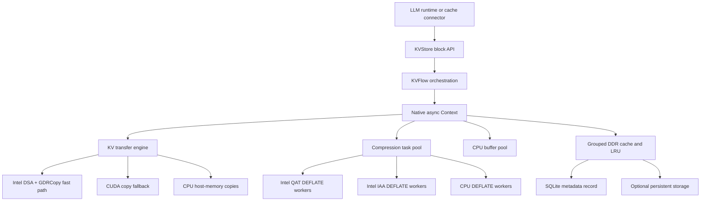
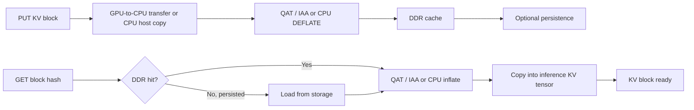

# IAXL Design

## Purpose

IAXL is an Intel reference solution that demonstrates how Intel data-movement and compression accelerators improve LLM inference infrastructure. It provides a block-oriented data path for copying KV cache blocks from inference tensors, compressing them, and retaining them in host memory or persistent storage. Inference tensors can reside on CPU, CUDA, or XPU devices.

The design keeps model kernels unchanged. Integrations use the Python `KVStore` API, while IAXL selects native transfer and compression backends underneath it.

## Responsibilities

- Store and retrieve KV blocks by stable hashes.
- Move fragmented KV blocks between GPU and CPU memory.
- Compress cached data with Intel QuickAssist Technology (QAT) or Intel In-Memory Analytics Accelerator (IAA), with a compatible CPU DEFLATE backend.
- Keep hot data in a capacity-bounded DDR cache and optionally persist groups to local storage.
- Execute transfer, compression, and storage work asynchronously and expose completion through task handles.

## Architecture

```mermaid
flowchart TD
    Runtime["LLM runtime or cache connector"] --> API["KVStore block API"]
    API --> Flow["KVFlow orchestration"]
    Flow --> Context["Native async Context"]

    Context --> Xfer["KV transfer engine"]
    Xfer --> DSA["Intel DSA + GDRCopy fast path"]
    Xfer --> Fallback["CUDA copy fallback"]
    Xfer --> HostCopy["CPU host-memory copies"]

    Context --> Zip["Compression task pool"]
    Zip --> QAT["Intel QAT DEFLATE workers"]
    Zip --> IAA["Intel IAA DEFLATE workers"]
    Zip --> CPU["CPU DEFLATE workers"]

    Context --> Pool["CPU buffer pool"]
    Context --> Cache["Grouped DDR cache and LRU"]
    Cache --> Record["SQLite metadata record"]
    Cache --> Storage["Optional persistent storage"]
```

`KVStore` owns model- and rank-local cache state. `KVFlow` converts tensor layers and block indices into asynchronous native tasks. The native `Context` coordinates transfer completion, compression, cache insertion, lookup, decompression, and buffer lifetime.

## KV Block Flow

```mermaid
flowchart LR
    Put["PUT KV block"] --> D2H["GPU-to-CPU transfer or CPU host copy"]
    D2H --> Compress["QAT / IAA or CPU DEFLATE"]
    Compress --> DDR["DDR cache"]
    DDR --> Persist["Optional persistence"]

    Lookup["GET block hash"] --> Hit{"DDR hit?"}
    Hit -->|Yes| Decompress["QAT / IAA or CPU inflate"]
    Hit -->|No, persisted| Reload["Load from storage"]
    Reload --> Decompress
    Decompress --> H2D["Copy into inference KV tensor"]
    H2D --> Ready["KV block ready"]
```

On `PUT`, IAXL copies selected chunks from inference tensors into reusable CPU buffers. Compression starts only after the transfer is complete, then the encoded payload is inserted into the grouped cache. On `GET`, IAXL resolves the hash, reloads persisted data on a DDR miss when available, decompresses into CPU buffers, and copies the requested chunks back to the selected inference tensor positions.

### CPU Inference

`DEVICE=cpu` keeps the same `Context`/`KVStore` API and codec. When blocks lie on
axis 0 (the vLLM 0.23 CPU layout `[blocks, heads, tokens, 2·head_size]`), each block
is a contiguous slice of the KV tensor, so KVFlow hands those slices to the codec
directly: PUT compresses from the block and GET decompresses into it, with no
scratch buffers and no `ScratchPool`. Byte shuffle and lossy truncation rewrite the
codec input in place, so with either enabled, and for other layouts, blocks go
through scratch buffers with a host `memcpy`. Because on CPU every core the cache
path occupies is a core taken from the model's own GEMMs, IAXL threads are placed
explicitly.

**Core partitioning.** `IAXL_CPU_AFFINITY` pins every IAXL native thread (the
`H2D`/`D2H`/`OMP-Main` queue workers and each codec OpenMP worker) to a CPU list
disjoint from `VLLM_CPU_OMP_THREADS_BIND`; the connector refuses more than one codec
thread on inference CPUs and warns for one. Without this the codec pollers preempt
inference OpenMP threads and the cost surfaces as libgomp barrier spin, not as codec
time. The codec team is sized from the QAT/IAA instance counts and CPU zip threads,
not from inference's `OMP_NUM_THREADS`.

The CPU connector derives the block axis from the attention layout (`[2, blocks,
heads, tokens, head_size]` with block dimension 1, or the HND `[blocks, heads,
tokens, 2·head_size]` layout with block dimension 0). CPU persistence has a separate
`cpu` directory under the configured cache root, since GPU cache layouts can differ
despite identical byte sizes. The payload format, layerwise waits, and storage
lifecycle are shared with the GPU path. Both `IAXL_QATLIB` modes (`oot`, `intree`)
work for the CPU build without changing the CPA implementation.

## Intel Accelerator Optimizations

### Intel DSA

On supported CUDA systems, IAXL uses GDRCopy to map GPU memory into a CPU-visible BAR address and submits fragmented H2D or D2H regions as an Intel DSA batch. This offloads data movement and avoids issuing many small copy operations through the normal GPU copy path. If DSA is disabled, unavailable, or cannot serve a tensor layout, IAXL falls back to batched CUDA copies.

### Intel QAT and Intel IAA

Intel QAT and Intel IAA perform DEFLATE compression and decompression outside the model compute path. Both keep multiple operations in flight, and optional CPU workers consume the same dynamic task pool. All backends produce compatible streams, so work is balanced by completion rate rather than statically partitioned by block.

Optional byte shuffling improves BF16 compressibility, and independently configured lossy LSB truncation can trade precision for a higher compression ratio. Compressing KV blocks increases effective DDR and storage capacity and reduces persistence traffic. When QAT or IAA is enabled, the expensive DEFLATE work is offloaded to dedicated hardware and queued asynchronously, targeting substantial size reduction with minimal impact on inference performance.

## Design Optimizations

- **Asynchronous pipeline:** native work queues, plus device streams on GPUs, overlap transfer, compression, and inference where dependencies allow.
- **Batch-oriented movement:** block fragments are copied in batches; DSA requires an 8-byte-aligned inner copy width, and unsupported layouts automatically use CUDA copies.
- **Pinned-buffer reuse:** `ScratchPool` avoids allocation and registration on the hot path.
- **Hybrid compression:** QAT and IAA provide the accelerated paths; CPU workers provide additional throughput and a compatible software path.
- **Selective compression:** latency-sensitive leading layers can bypass compression while later layers remain compressed.
- **Capacity management:** grouped entries, LRU tracking, and explicit persist/evict operations bound DDR use without changing block identity.
- **Topology-aware deployment:** each tensor-parallel rank can be bound to nearby CPU cores, QAT or IAA devices, and DSA work queues.

IAXL is intentionally a narrow infrastructure layer: it provides reusable hardware-accelerated KV movement and storage primitives, while serving frameworks retain ownership of scheduling and request semantics.
