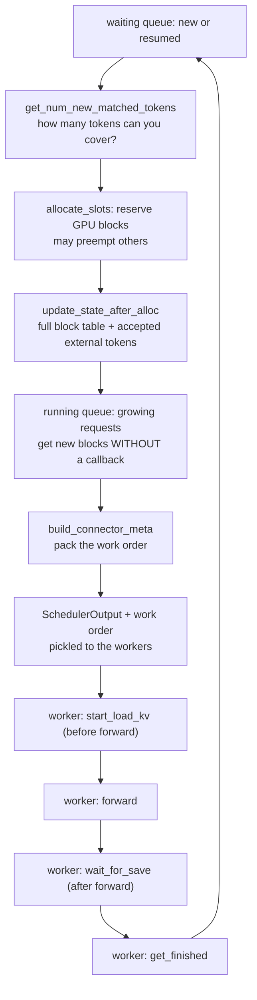
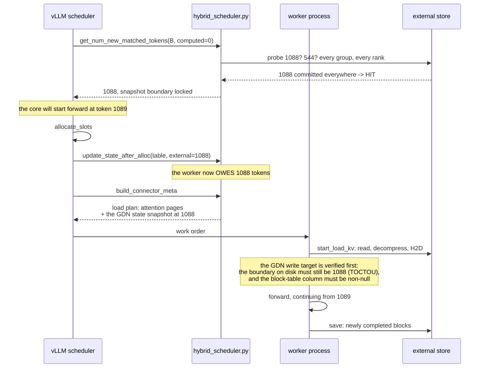
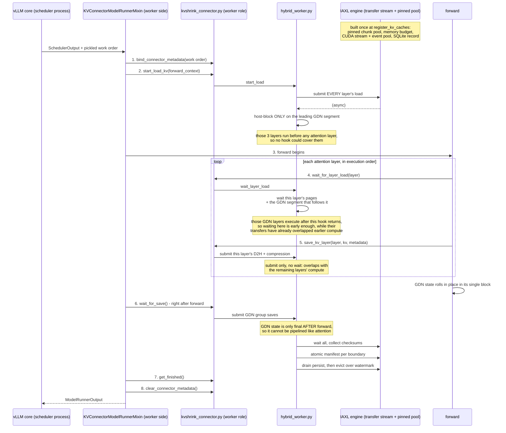
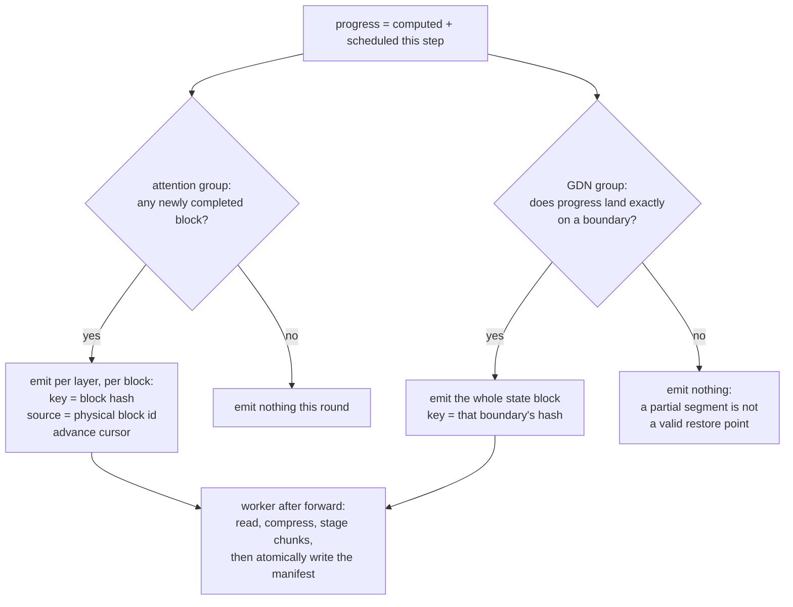
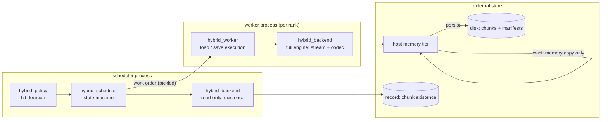

# KVShrink Hybrid (GDN/Mamba) Design

Companion to `kvshrink.md`, which covers the attention-only connector.
This document covers what changes when the model also has GDN/Mamba
layers (Qwen3.5 and similar). Read it and you should not need to open
the code to know what the package does and where vLLM calls into it.

Everything below was verified against vLLM **v0.23.0**; file and symbol
names are the real ones.

---

## 1. Why hybrid models need their own path

| | Attention layer | GDN/Mamba layer |
|---|---|---|
| What is cached | `block_size` tokens of KV per block | one fixed-size recurrent state (conv + ssm) |
| Restorable from | any block boundary | **only an aligned segment boundary** |
| Blocks per request | grows with length, new block every `block_size` tokens | **exactly one**, updated in place forever |
| After the request ends | block returns to the pool | block returns to the pool **and is reused by the next request**, so the state is gone |

Two consequences drive the whole design:

1. A GDN snapshot is addressed by a **boundary** (a token count), not by
   an offset, and only boundaries are valid restore points.
2. Because the state block is recycled, restoring a prefix *requires*
   reading the snapshot back from outside; there is nothing left on the
   GPU to reuse.

### 1.1 The configuration this depends on

vLLM only exposes boundary-addressable GDN state in `align` mode:

- `mamba_get_block_table_tensor` (align) gathers the single column
  `block_table[(seq_len - 1) // block_size]`;
- `Scheduler.need_mamba_block_aligned_split` is
  `has_mamba_layers and mamba_cache_mode == "align"`, so chunk
  splitting only lands on boundaries in that mode.

vLLM defaults prefix caching **off** for hybrid models
(`ModelConfig.is_prefix_caching_supported` returns False for
`attn_type == "hybrid"`) and then silently rewrites the cache mode to
`none`. In that state a request holds one `max_model_len` block, chunks
stop at arbitrary positions, and no snapshot could ever be keyed to a
reproducible prefix length. The connector therefore **refuses to start**
unless the mode is `align` (`hybrid_config.py`), naming the flags that
fix it. Serving must use:

```
--enable-prefix-caching --mamba-cache-mode align --no-disable-hybrid-kv-cache-manager
```

(`examples/kvshrink-vllm-serve.sh` does this when `KVSHRINK_HYBRID=1`.)

---

## 2. Glossary

### 2.1 vLLM concepts

| Term | Meaning |
|---|---|
| **block** | Smallest unit of KV cache. Holds `block_size` tokens for one layer. GPU memory is a pool; a block id is an index into that pool. |
| **block table** | Per request: logical block *i* to physical block id. Allocation is not contiguous. For a mamba group the table is **full length with null (0) placeholders**, and only the current boundary's column is read. |
| **group** | vLLM buckets layers with identical storage specs. A hybrid model has at least one mamba group and one or more attention groups. |
| **pass / step** | One scheduler decision plus its worker execution. |
| **preemption** | vLLM evicts a request under memory pressure and resumes it later. Resumed requests arrive in `resumed_req_ids`, *not* in the new-request list. |
| **HMA** | Hybrid Memory Allocator. In v0.23 it is on by default and a connector must implement `SupportsHMA` or the factory rejects it. |

### 2.2 This package

| Term | Meaning |
|---|---|
| **boundary** | A token count at which a GDN snapshot may exist. Snapshots exist only here; a lookup that lands elsewhere walks left to the previous boundary. |
| **block hash** | Content hash of a block, computed by vLLM's own `hash_block_tokens`. In v0.23 it is **sha256 bytes**, not an int. Storage is content addressed, which is what makes the cache shared across requests. |
| **namespace** | Top-level isolation derived from the model/topology, so different models or TP layouts never collide. Below it: `tp_size / rank / group / boundary hash`. |
| **chunk** | The storage layer's transfer unit. Each page is split into chunks that are compressed, named and persisted independently. |
| **manifest** | The atomic commit point for a group of chunks. Chunks are staged first; the manifest is written last. **Before the manifest lands, the group is invisible**, so a crash mid-write cannot produce a false hit. |
| **snapshot boundary** | The token count a request restored to. Locked at lookup time and never recomputed afterwards, because by then the progress counters have already moved. |
| **save cursor** (`next_stored_chunk_idx`) | Per group: what has already been emitted. Rolls **back** on resume, because saves issued before preemption may never have been persisted; re-emitting is an idempotent overwrite. |
| **fail-closed** | The first principle. A false hit corrupts output silently; a false miss costs one recompute. Every uncertain case resolves to MISS, refuse, or raise. |

### 2.3 Processes

The connector class is instantiated **once per process** with a `role`:

- **scheduler role** — answers "is it cached, how much, what should be
  moved". Its backend is read-only: existence checks only, no GPU
  stream, no memory pool, no writer lease.
- **worker role** (one per rank) — executes the plan. Owns the canonical
  page views, the transfer engine and this rank's single-writer lease.

The two never share memory. Each pass the scheduler side packs a
`KVShrinkConnectorMetadata` (the *work order*) which is pickled to the
workers, so the work order must be self-contained.

---

## 3. Module map

| File | Role |
|---|---|
| `kvshrink_connector.py` | The vLLM interface. Dispatches to the hybrid stack when `kv_cache_config.has_mamba_layers`, otherwise runs the original attention-only code unchanged. |
| `hybrid_scheduler.py` | Scheduler-side per-request state machine: hit registration, block-table mirror, save cursor, plan construction. |
| `hybrid_policy.py` | Hit decision: contiguous prefix, all groups agreeing, boundary alignment. Anything unclear is a MISS. |
| `hybrid_canonical.py` | Canonical page views over the raw KV tensors, including split K/V layouts. |
| `hybrid_config.py` | Parses vLLM's `KVCacheConfig` into groups/layers. Every anomaly raises. |
| `hybrid_metadata.py` | Keys and work-order structures. Pure data, picklable. |
| `hybrid_worker.py` | Worker-side execution: piggybacked loads, pipelined saves, poison and fail-stop. |
| `hybrid_backend.py` | Storage adapter: key translation, role-specific construction, cross-rank verification. Any exception becomes a MISS. |
| `hybrid_metrics*.py` | Metric definitions and the standalone exporter. |

---

## 4. How vLLM drives the connector



Three things that shape the implementation:

- **New blocks for running requests are not announced by a callback.**
  They arrive as `new_block_ids` alongside `SchedulerOutput`, so each
  pass must **mirror the block table first, then build the save plan** —
  the order cannot be reversed or the plan references stale block ids.
- **`update_state_after_alloc` runs only after a successful allocation**,
  so external tokens are never promised and then dropped.
- **Resumed requests come through a separate channel.** Missing them
  produces the worst possible bug: the core believes tokens need no
  recompute while the worker never restored them.

---

## 5. Following one request

Concrete numbers from the real Qwen3.5-0.8B run: **24 layers, 6 of them
attention, boundary granularity 544 tokens**.

### 5.1 Miss — a prefix seen for the first time

```mermaid
sequenceDiagram
    participant Core as vLLM scheduler
    participant Sched as hybrid_scheduler.py
    participant W as worker process
    participant Store as external store<br/>(host memory + disk)

    Core->>Sched: get_num_new_matched_tokens(A, computed=0)
    Sched->>Store: probe boundaries by block hash
    Store-->>Sched: all MISS
    Sched-->>Core: 0 (nothing can be skipped)
    Core->>Core: allocate_slots
    Core->>Sched: update_state_after_alloc(block table, 0)
    Note over Sched: register RequestState:<br/>hash chain, block-table mirror, cursor=0
    Core->>Sched: build_connector_meta
    Sched-->>Core: save plan only, no loads
    Core->>W: work order (pickled)
    W->>W: forward, computing all 1200 tokens
    W->>Store: save: pages compressed and staged
    Note over W,Store: manifest written last;<br/>only now are these pages visible to lookups
```

A miss is not a failure: its whole purpose is to leave a snapshot behind
for the next request with the same prefix.

### 5.2 Hit — a second request sharing the prefix

Request B shares the first 1088 tokens (1088 = 2 x 544, exactly on a
boundary).



If B diverged at token 1000 instead, the hit **walks left to 544**:
restore 544, recompute 544..1000. GDN state has no valid restore point
in between.

### 5.3 The worker pass in exact order

This is the part that differs most from the attention-only connector,
and from the previous generation of this work.

vLLM's load hook `wait_for_layer_load` is attached to **attention
operators only** (`kv_transfer_utils.maybe_transfer_kv_layer`). GDN
layers never trigger it. Rather than patch vLLM, each GDN layer is
waited for by **the attention layer that runs before it**:

```
execution order:  [GDN x3]  attn1  [GDN x3]  attn2  [GDN x3]  attn3 ...
                     |               |                |
                     |               |                +- waited in attn3's hook
                     |               +- waited in attn2's hook
                     +- no attention layer precedes it: waited in start_load_kv
```

Layer execution order is derived with `extract_layer_index` over the
layer names — the same method vLLM's own `bind_kv_cache` uses — because
the `kv_caches` dict is built **per KV cache group**, so its key order
groups all mamba layers together and does not reflect execution order.
Duplicate or unparsable indices fail closed.



**Fail-stop at the end of the step**: if any layer was never waited for,
the worker raises instead of letting forward read unrestored state. A
missed hook is a silent-corruption bug, so it is made loud.

### 5.4 Which slot the GDN snapshot is written to

The previous generation wrote both the `prev` and `curr` slots because
the timing of vLLM's prev-to-curr copy was uncertain. Reading the v0.23
source settles it: in `align` mode the kernels gather exactly one column,

```
curr_idx = (boundary_tokens + scheduled_tokens - 1) // block_size
```

so there is a single correct target and **`CURR` only** is written.
If that column is out of range or null there is no second slot to fall
back on, so it fails stop.

Related guard: `num_speculative_blocks > 0` (speculative decoding) makes
the kernel gather `1 + num_speculative_blocks` columns while an external
snapshot only restores the first, so the connector **refuses to start**
in that configuration rather than restore a partially valid state.

### 5.5 What gets saved each pass



Note that the plan is **predictive**: it is built before forward but
describes the state after forward. By the time the worker executes it,
the GPU contents match.

### 5.6 Preemption and resume

- Resumed requests get their load plan built separately; if the core
  accepted external tokens and no load pages can be produced, the
  connector **raises** rather than enter forward with unrestored state.
- The save cursor **rolls back**, because saves issued before preemption
  may never have been persisted. Re-emitting is an idempotent overwrite.
- Progress moving backwards also triggers the rollback, so the guard
  holds even if the resumed flag is missing.

### 5.7 Request end

v0.23 routes this through `SupportsHMA.request_finished_all_groups`
(the attention-only path forwards to the original `request_finished`).
The request's state machine entry is dropped; **committed snapshots are
untouched**, because they are content addressed and belong to whoever
shares the prefix, not to the request that produced them.

`request_finished` returns `False` (release blocks immediately): saving
completes within the pass, so there is nothing outstanding. Returning
`True` without ever reporting completion through `get_finished` would be
a deterministic block leak.

---

## 6. Data flow



The scheduler side only answers *whether* and *how much*; the worker
side only executes. Visibility is gated solely by the manifest plus the
record, which is how "recompute rather than corrupt" is actually
implemented: **nothing half-written is ever visible to a lookup**.

---

## 7. Every fail-closed decision, in one table

| Situation | Response | Why |
|---|---|---|
| `mamba_cache_mode != "align"` | refuse to start | no addressable boundary exists; the cache would silently store nothing |
| `num_speculative_blocks > 0` | refuse to start | the kernel reads more columns than a snapshot restores |
| layer index duplicated or unparsable | refuse to start | execution order would be guessed, and the piggyback mapping depends on it |
| unknown spec, mismatched block sizes, unknown dtype | refuse to start | the page layout would be guessed |
| boundary missing on any TP rank | MISS | ranks commit independently; a partial commit heals when the request recomputes and re-saves |
| any exception during lookup | MISS | an unreadable store must never look like a hit |
| GDN block-table column null or out of range | raise | there is no second slot to fall back on |
| boundary on disk changed between lookup and load | raise | the snapshot no longer matches what the scheduler promised |
| a layer was never waited for by the end of the step | raise | forward would read unrestored state |
| external tokens accepted but no load pages producible | raise | the core already decided not to recompute them |

---

## 8. Reproducible block hashes

vLLM seeds its first block hash from `PYTHONHASHSEED` and **randomises
it when unset**, so a restart would change every key and miss
everything. `setvars.sh` and `tests/gpu/lib.sh` both pin
`PYTHONHASHSEED=0`.

---

## 9. Further reading

- Gates and how to run them, including the fast development loop:
  `tests/README.md`
- The attention-only connector: `doc/design/kvshrink.md`
- The acceleration layer underneath: `doc/design/iaxl.md`
